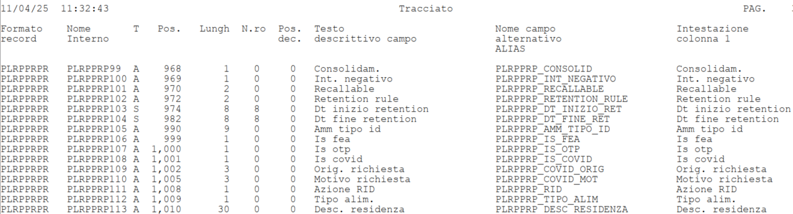

# fxFromAS400FieldsToTable
## Descrizione
Nel caso in cui vengano forniti i nomi di campo di una tabella AS400 come nel [file QPQUPRFIL_SYS8A01503_SISTPA1_883178_6.pdf](./QPQUPRFIL_SYS8A01503_SISTPA1_883178_6.pdf), è possibile creare una tabella Excel con la funzione sottostante


## Input
- **FilePDF**: un percorso completo al file senza doppi apici come *C:\cartella\QPQUPRFIL_SYS8A01503_SISTPA1_883178_6.pdf*


## Output
Una tabella completa di Excel


## Esempio
Partendo da un file in PDF come questo:


Si ottiene una tabella Excel con i nomi di campo.

## Funzione

```sql
(FilePDF as text) =>
let
    Source = Pdf.Tables(File.Contents(FilePDF), [Implementation="1.3"]),
    Table001 = Source{[Id="Table001"]}[Data],
    KeptFirstFourRows = Table.FirstN(Table001,4),
    TransposedFourRowsTable = Table.Transpose(KeptFirstFourRows),
    MergedColumns = Table.CombineColumns(TransposedFourRowsTable,{"Column1", "Column2", "Column3", "Column4"},Combiner.CombineTextByDelimiter(" ", QuoteStyle.None),"Merged"),
    HeadersTable = Table.ToRows( Table.Transpose(MergedColumns) ){0},
    RemovedTopFourRows = Table.Skip(Table001,4),
    MixHeaders = List.Zip(
    {
        Table.ColumnNames(RemovedTopFourRows),
        HeadersTable
    }
),
    #"Renamed Columns" = Table.RenameColumns(RemovedTopFourRows,MixHeaders)
in
    #"Renamed Columns"
```